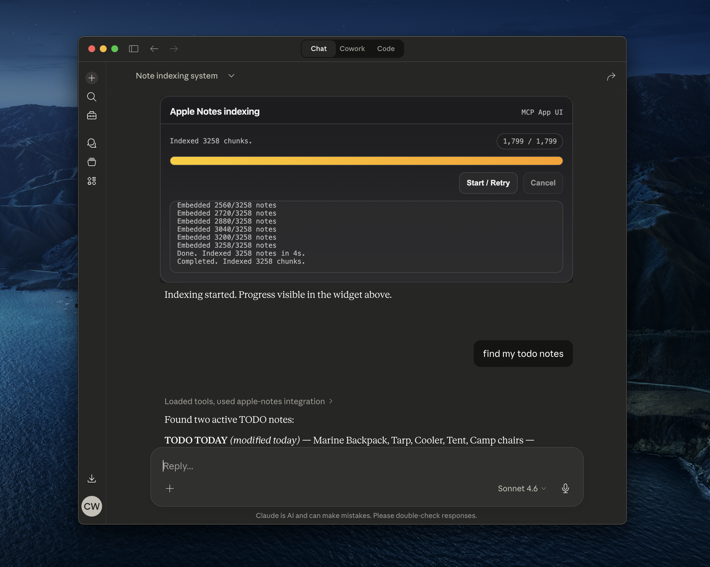
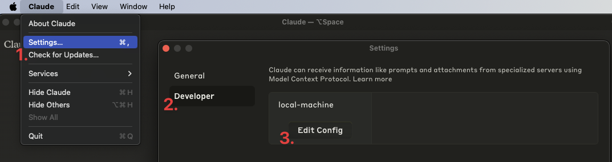
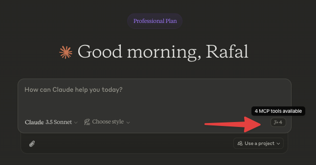

# MCP Apple Notes


A [Model Context Protocol (MCP)](https://www.anthropic.com/news/model-context-protocol) server that enables semantic search and RAG (Retrieval Augmented Generation) over your Apple Notes. This allows AI assistants like Claude to search and reference your Apple Notes during conversations.



## Features

- 🔍 Semantic search over Apple Notes using [`all-MiniLM-L6-v2`](https://huggingface.co/sentence-transformers/all-MiniLM-L6-v2) on-device embeddings model
- 📝 Full-text search capabilities
- 📊 Vector storage using [LanceDB](https://lancedb.github.io/lancedb/)
- 🤖 MCP-compatible server for AI assistant integration
- 🍎 Native Apple Notes integration via JXA
- 🏃‍♂️ Fully local execution - no API keys needed

## Prerequisites

- [Bun](https://bun.sh/docs/installation)
- [Claude Desktop](https://claude.ai/download)

## Installation

1. Clone the repository:

```bash
git clone https://github.com/RafalWilinski/mcp-apple-notes
cd mcp-apple-notes
```

2. Install dependencies:

```bash
bun install
```

3. After install, System Settings will open to **Full Disk Access** — add **Claude.app** there, then restart Claude Desktop.

## Usage

1. Open Claude desktop app and go to Settings -> Developer -> Edit Config



2. Open the `claude_desktop_config.json` and add the following entry:

```json
{
  "mcpServers": {
    "apple-notes": {
      "command": "/Users/<YOUR_USER_NAME>/.bun/bin/bun",
      "args": ["/Users/<YOUR_USER_NAME>/mcp-apple-notes/index.ts", "--stdio"]
    }
  }
}
```

Important: Replace `<YOUR_USER_NAME>` with your actual username.

3. Restart Claude desktop app. You should see this:



5. Start by indexing your notes. Ask Claude to index your notes by saying something like: "Index my notes" or "Index my Apple Notes".

## Indexing UI

The `index-notes` tool opens an inline MCP App UI panel inside Claude Desktop showing a live progress bar, status, and log stream. Indexing runs in the background — it does not block the conversation. You can cancel an in-progress job from the UI at any time.

The embedding model (`all-MiniLM-L6-v2`) is pre-warmed at server startup so it is ready before the first `index-notes` call.

## Troubleshooting

To see logs:

```bash
tail -n 50 -f ~/Library/Logs/Claude/mcp-server-apple-notes.log
# or
tail -n 50 -f ~/Library/Logs/Claude/mcp.log
```

## Todos

- [ ] Apple notes are returned in the HTML format. We should turn them to Markdown and embed that
- [ ] Chunk source content using recursive text splitter or markdown text splitter
- [ ] Add an option to use custom embeddings model
- [ ] More control over DB - purge, custom queries, etc.
- [x] Storing notes in Notes via Claude
